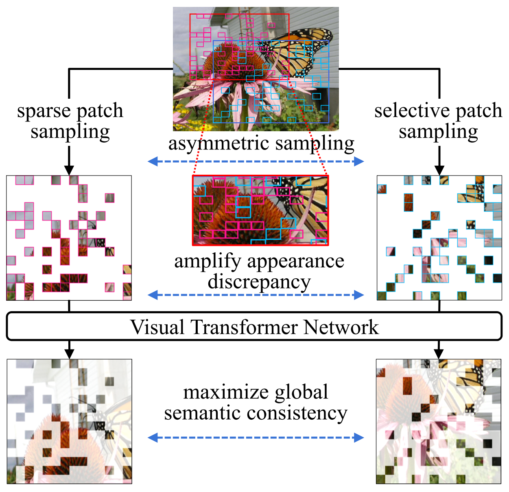

## Asymmetric Patch Sampling for Contrastive Learning

PyTorch implementation and pre-trained models for paper APS: **Asymmetric Patch Sampling for Contrastive Learning**.

<p align="center"> </p>

APS is a novel asymmetric patch sampling strategy for contrastive learning, to further boost the appearance asymmetry for better representations. APS significantly outperforms the existing self-supervised methods on both ImageNet-1K and CIFAR dataset, e.g., 2.5% finetune accuracy improvement on CIFAR100. Additionally, compared to other self-supervised methods, APS is more efficient on both memory and computation during training.

  [[Paper](https://arxiv.org/abs/2306.02854)]    [[BibTex](#Citation)]

### Requirements

---

```
conda create -n asp python=3.9
pip install -r requirements.txt
```

### Datasets

---

Torchvision provides `CIFAR10`, `CIFAR100` datasets. The root paths of data are respectively set to `./dataset/cifar10` and `./dataset/cifar100`. `ImageNet-1K` dataset is placed at `./dataset/ILSVRC`.

### Pre-training

---

To start the APS pre-training, simply run the following commands.

#### •  Arguments

- `arch` is the architecture of the pre-trained models，you can choose `vit-tiny`, `vit-small` and `vit-base`.
- `dataset` is the pre-trained dataset.
- `data-root` is the path of the dataset.
- `nepoch` is the pre-trained epochs.

Run APS with `ViT-Small/2` network on a single node on `CIFAR100` for 1600 epochs with the following command.

```bash
python main_pretrain.py --arch='vit-small' --dataset='cifar100' --data-root='./dataset/cifar100' --nepoch=1600
```

### Finetuning

---

To finetune `ViT-Small/2` on `CIFAR100`  with the following command.

```bash
python main_finetune.py --arch='vit-small' --dataset='cifar100' --data-root='./dataset/cifar100'  \
                   --pretrained-weights='./weight/pretrain/cifar100/small_1600ep_5e-4_100.pth'
```

### Trained Model Weights & Finetune Accuracy

---
+ **CIFAR10 and  CIFAR100**

|      Dataset      | Training (#Epochs) |                                   ViT-Tiny/2                                   |                                   ViT-Small/2                                   |                                   ViT-Base/2                                   |
| :----------------: | :----------------: | :-----------------------------------------------------------------------------: | :-----------------------------------------------------------------------------: | :-----------------------------------------------------------------------------: |
| **CIFAR10** |  Pretrain (1600)  | [download](https://mega.nz/folder/5adT0LZI#xRBUoFehvy8I91gYfNfyMQ/folder/9T1jnaIC) | [download](https://mega.nz/folder/5adT0LZI#xRBUoFehvy8I91gYfNfyMQ/folder/9T1jnaIC) | [download](https://mega.nz/folder/5adT0LZI#xRBUoFehvy8I91gYfNfyMQ/folder/9T1jnaIC) |
|                    |   Finetune (100)   | [download](https://mega.nz/folder/5adT0LZI#xRBUoFehvy8I91gYfNfyMQ/folder/VT0zUI7Z) | [download](https://mega.nz/folder/5adT0LZI#xRBUoFehvy8I91gYfNfyMQ/folder/VT0zUI7Z) | [download](https://mega.nz/folder/5adT0LZI#xRBUoFehvy8I91gYfNfyMQ/folder/VT0zUI7Z) |
|                    | **Accuracy** |                                      97.2%                                      |                                      98.1%                                      |                                      98.2%                                      |
|                    |  Pretrain (3200)  | [download](https://mega.nz/folder/5adT0LZI#xRBUoFehvy8I91gYfNfyMQ/folder/9T1jnaIC) | [download](https://mega.nz/folder/5adT0LZI#xRBUoFehvy8I91gYfNfyMQ/folder/9T1jnaIC) | [download](https://mega.nz/folder/5adT0LZI#xRBUoFehvy8I91gYfNfyMQ/folder/9T1jnaIC) |
|                    |  Finetune  (100)  | [download](https://mega.nz/folder/5adT0LZI#xRBUoFehvy8I91gYfNfyMQ/folder/oH8XDCrb) | [download](https://mega.nz/folder/5adT0LZI#xRBUoFehvy8I91gYfNfyMQ/folder/oH8XDCrb) | [download](https://mega.nz/folder/5adT0LZI#xRBUoFehvy8I91gYfNfyMQ/folder/oH8XDCrb) |
|                    | **Accuracy** |                                      97.5%                                      |                                      98.2%                                      |                                      98.3%                                      |
| **CIFAR100** |  Pretrain (1600)  | [download](https://mega.nz/folder/5adT0LZI#xRBUoFehvy8I91gYfNfyMQ/folder/Fa8nSYqD) | [download](https://mega.nz/folder/5adT0LZI#xRBUoFehvy8I91gYfNfyMQ/folder/Fa8nSYqD) | [download](https://mega.nz/folder/5adT0LZI#xRBUoFehvy8I91gYfNfyMQ/folder/Fa8nSYqD) |
|                    |  Finetune  (100)  | [download](https://mega.nz/folder/5adT0LZI#xRBUoFehvy8I91gYfNfyMQ/folder/dK0T2QrS) | [download](https://mega.nz/folder/5adT0LZI#xRBUoFehvy8I91gYfNfyMQ/folder/dK0T2QrS) | [download](https://mega.nz/folder/5adT0LZI#xRBUoFehvy8I91gYfNfyMQ/folder/dK0T2QrS) |
|                    | **Accuracy** |                                      83.4%                                      |                                      84.9%                                      |                                      85.9%                                      |
|                    |  Pretrain (3200)  | [download](https://mega.nz/folder/5adT0LZI#xRBUoFehvy8I91gYfNfyMQ/folder/Fa8nSYqD) | [download](https://mega.nz/folder/5adT0LZI#xRBUoFehvy8I91gYfNfyMQ/folder/Fa8nSYqD) | [download](https://mega.nz/folder/5adT0LZI#xRBUoFehvy8I91gYfNfyMQ/folder/Fa8nSYqD) |
|                    |  Finetune  (100)  | [download](https://mega.nz/folder/5adT0LZI#xRBUoFehvy8I91gYfNfyMQ/folder/0SkXCAoY) | [download](https://mega.nz/folder/5adT0LZI#xRBUoFehvy8I91gYfNfyMQ/folder/0SkXCAoY) | [download](https://mega.nz/folder/5adT0LZI#xRBUoFehvy8I91gYfNfyMQ/folder/0SkXCAoY) |
|                    | **Accuracy** |                                      83.4%                                      |                                      85.3%                                      |                                      86.0%                                      |

+ **ImageNet-1K**

| Backbone |                    Pretrain (300 epochs)                     |                    Finetune (100 epochs)                     |
| :------: | :----------------------------------------------------------: | :----------------------------------------------------------: |
| ViT-S/16 | [download](https://mega.nz/folder/5adT0LZI#xRBUoFehvy8I91gYfNfyMQ/folder/sP8HgIDL) | 82.1% ([download](https://mega.nz/folder/5adT0LZI#xRBUoFehvy8I91gYfNfyMQ/folder/sCsxDKpQ)) |
| ViT-B/16 | [download](https://mega.nz/folder/5adT0LZI#xRBUoFehvy8I91gYfNfyMQ/folder/sP8HgIDL) | 84.2% ([download](https://mega.nz/folder/5adT0LZI#xRBUoFehvy8I91gYfNfyMQ/folder/sCsxDKpQ)) |


### LICENSE

---

This project is under the CC-BY-NC 4.0 license. See [LICENSE](LICENSE) for details.

### Citation

If you use this code for your research, please cite our papers.

```bibtex
@article{shen2023asymmetric,
      title={Asymmetric Patch Sampling for Contrastive Learning}, 
      author={Shen, Chengchao and Chen, Jianzhong and Wang, Shu and Kuang, Hulin and Liu, Jin and Wang, Jianxin},
      journal={arXiv preprint arXiv:2306.02854},
      year={2023}
}
```
